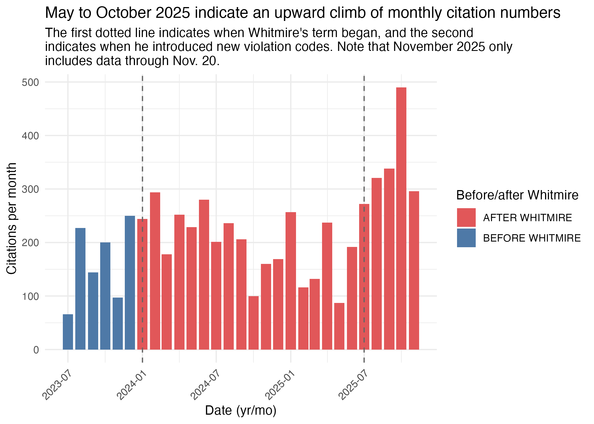

## Index

1. About this data
2. Limitations and considerations
3. Quick facts
4. Analysis summary

## 1. About this data

This project is a project for the Media Innovation Group at the University of Texas at Austin in collaboration with Houston Public Media. 

It is a study of Houston court data showing citations given to unhoused people in downtown Houston. The data ranges from Jan. 1 2016 to Oct. 28 2025, and includes columns detailing defendant information, offense date, offense location, court judgment date, fines information and violation description. To map offense locations, addresses are geocoded using geocod.io. OpenRefine was also used to cluster people with misspelled or varied names.

John Whitmire became Houston mayor in Jan. 2024, promising to end street homelessness during his term. Therefore this summary will often compare numbers and underline differences between before and after his term began. 

There are seven types of violations that have been given since 2016, all of which can be categorized into a sidewalk obstruction ordinance, civility ordinance or other. There are also four new violation types that were only introduced in 2025, three of which are sidewalk obstructions, the fourth is other. 

## 2. Limitations and considerations

* OpenRefine was used to cluster misspelled and varied names. Each decision was made manually based on calculated judgment calls, which may portray people with more/less citations than they actually received. It may also impact how many individual people are estimated to have received citations.
* Some citations have duplicate case numbers because the second appearance tracks how the case developed. So, to confidently know that each row does represent an individual citation, an object that does not have duplicate rows will be created at the beginning of the Analysis notebook. In that object, the second appearance of each case will be kept because that provides the most updated data.

## 3. Quick facts

## 4. Summary

#### 4.1 Citation count over time

Looking six months before Whitmire's term began, October 2025 saw the highest citation numbers in that date range, at 490. The monthly citation count from May to October seems to be on an upward climb.

Looking back even further, October 2025 had the highest citation numbers in over four years. However, to put that in the larger context, October 2025 only had 61.5% of the Jan. 2021 citation count, which is the highest citation month in this data set. 

See more about citation counts over time in section 2 of the analysis notebook.

#### 4.2 Violations

There are seven types of violation codes that have been given since 2016: @ask dominic about summaries and link to the more detailed information.

1. **CC753:** selling goods in public area
2. **CC921:** a sidewalk obstruction ordinance @Dominic how is this different from 941?
    i) Sidewalk obstruction: OBSTRUCT SIDEWALK BY (PLACING/DEPOSITING/PERMIT PERSON UNDER CONTROL) OBJECT (BOX/MAT./VEH./ETC.)
3. **CC940:** person obstructing sidewalk by sitting/laying down between 7 a.m. and 11 p.m.
4. **CC941:** obstructing sidewalk with bed mat or personal possessions between 7 a.m. and 11 p.m.
5. **CC942:** impair or obstruct sidewalk without a permit
6. **CC943:** impair or obstruct sidewalk beyond scope of permit
7. **CC948:** place or allow obstruction on sidewalk @Dominic how is this different to others?
    i) Sidewalk obstruction: PLACE OR ALLOW OBSTRUCTION ON SIDEWALK
8. **CC956:** a street vendor ordinance @Dominic how is this different to 753?
    i) EXPOSE FOR SALE MERCHANDISE, TO-WIT:...ON A PUBLIC (SIDEWALK) (STREET) (ESPLANADE) (PROPERTY)

CC940 and CC941 monthly citation numbers follow similar trends throughout the year (Analysis 3.3.2), suggesting they have been given out at the same rate.

After Whitmire introduced three new sidewalk obstruction ordinances this year, October 2025 had highest sidewalk obstruction citations per month in this data set. The 127 citations made up around 38% of all citations given that month.

