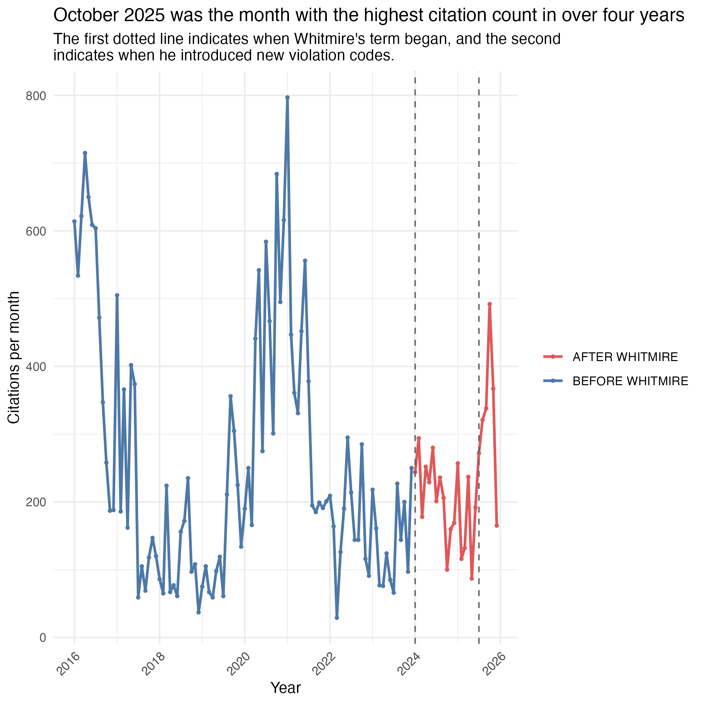
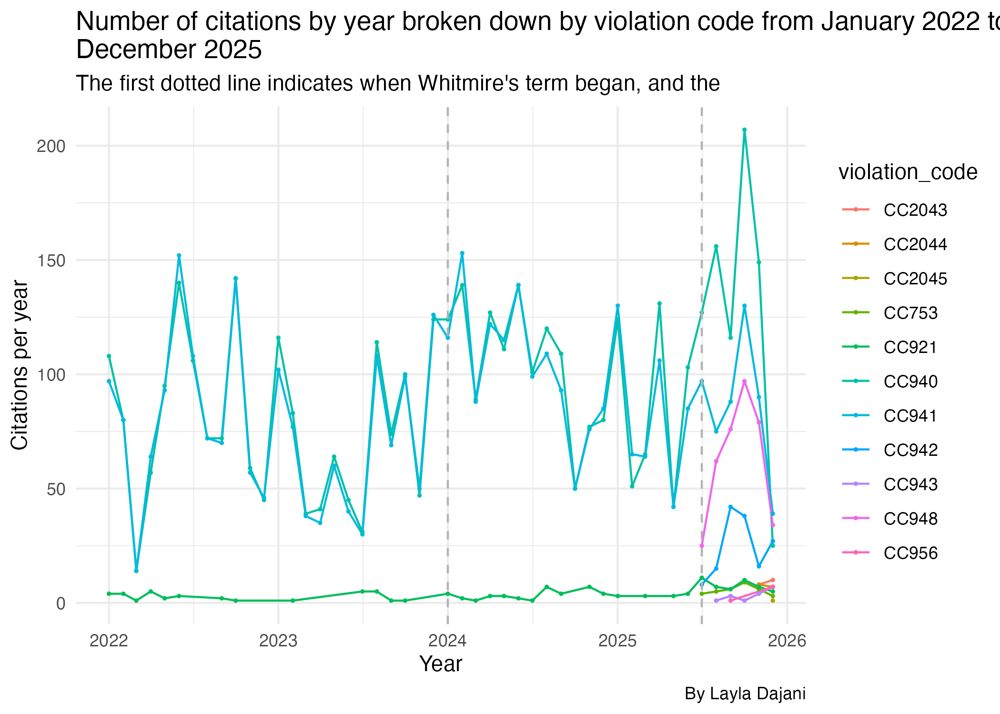
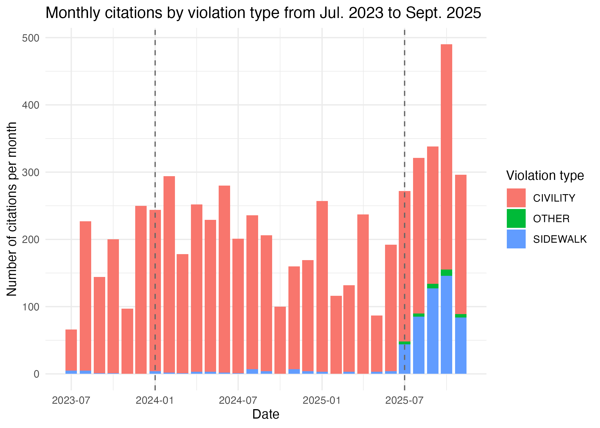
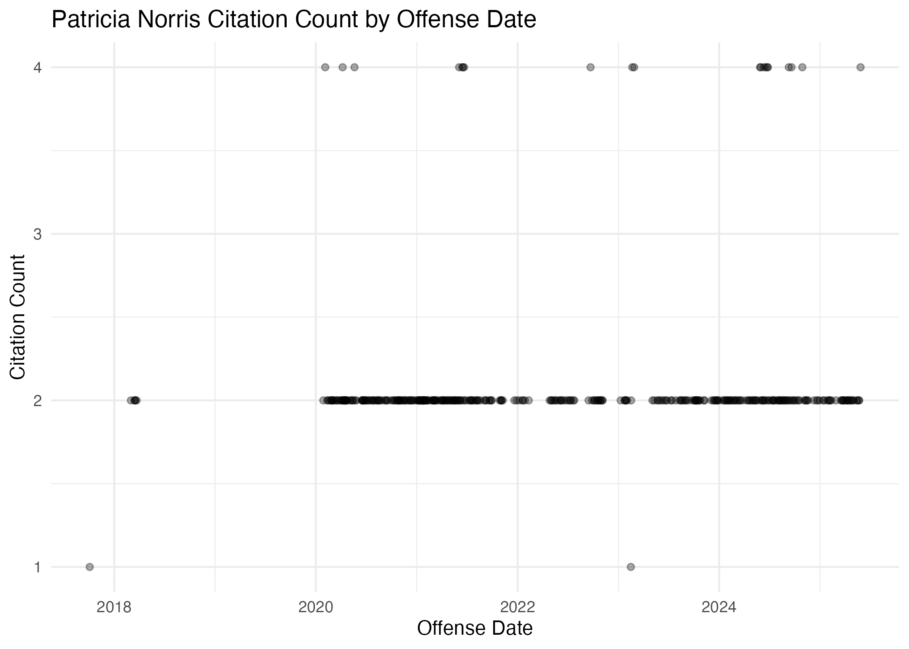

## Index

1. About this data
2. Limitations and considerations
3. Visualizations
4. Also of interest

## 1. About this data

This project is a project for the Media Innovation Group at the University of Texas at Austin in collaboration with Houston Public Media. 

It is a study of Houston court data showing citations given to unhoused people in downtown Houston. The data ranges from Jan. 1, 2016 to Oct. 28, 2025, and includes columns detailing defendant information, offense date, offense location, court judgment date, fines information and violation description. To map offense locations, addresses are geocoded using geocod.io. OpenRefine was also used to cluster people with misspelled or varied names.

John Whitmire became Houston mayor in January 2024, promising to end street homelessness during his term. Therefore this summary will often compare numbers and underline differences before and after his term began. 

There are seven types of violations that have been given since 2016, all of which can be categorized into a sidewalk obstruction ordinance, civility ordinance or other. There are also four new violation types that were only introduced in 2025, three of which are sidewalk obstructions, the fourth is other. See a more detailed breakdown of each violation code in [section 3](02-analysis.html#violation-types) of the analysis notebook.

## 2. Limitations and considerations

* OpenRefine was used to cluster misspelled and varied names. Each decision was made manually based on calculated judgment calls, which may portray people with more/less citations than they actually received. It may also impact how many individual people are estimated to have received citations. See [section 5.2](01-cleaning.html#importing-from-open-refine) of the cleaning notebook for more details on what OpenRefine was used for.
* Some citations have duplicate case numbers because the second appearance tracks how the case developed. So, to confidently know that each row does represent an individual citation, an object that does not have duplicate rows will be created in [section 1](02-analysis#creating-distinct-object) of the analysis notebook. In that object, the second appearance of each case will be kept because that provides the most updated data.
* 2025 only includes data through November 20. Despite this, analysis often includes November as an incomplete month. It is important to note that the data available for November 2025 is not representative of the whole month. Additionally, when averages in monthly calendar or yearly charts are made, the lack of complete data from November and December 2025 may skew these results.
* Cases from recent months are yet to receive a judgment. Therefore, recent months may not be representative of judgment statistics.

## 3. Visualizations

Find interactive versions of each visualization in the analysis notebook. Interactive versions offer details for specific points or elements on a chart. For instance:

* Hover the mouse over data points to view more details about it. 
* Left click and drag the mouse to select particular parts of a visualization to expand. 
* Select and deselect elements from the legend to view or hide parts of the chart.

#### 3.1 Citation counts over time

Between July 2023 (six months before Whitmire's term began) and November 2025, October 2025 had the highest citation count in that date range, at 490 that month. Leading up to that, the monthly citation count from May to October indicates an incline. Looking back even further, October 2025 had the highest citation count in over four years. 

However, to put that in the larger context, October 2025 only had 61.5% of the January 2021 citation count, which is the highest citation month in this data set. 

See more about citation counts over time in [section 2](02-analysis.html#citation-numbers-over-time) of the analysis notebook.

#### 3.2 Violations types

There are seven types of violation codes that have been given since 2016:

1. **CC753:** selling goods in public area
2. **CC921:** a sidewalk obstruction ordinance
    i) Sidewalk obstruction: OBSTRUCT SIDEWALK BY (PLACING/DEPOSITING/PERMIT PERSON UNDER CONTROL) OBJECT (BOX/MAT./VEH./ETC.)
3. **CC940:** person obstructing sidewalk by sitting/laying down between 7 a.m. and 11 p.m.
4. **CC941:** obstructing sidewalk with bed mat or personal possessions between 7 a.m. and 11 p.m.
5. **CC942:** impair or obstruct sidewalk without a permit
6. **CC943:** impair or obstruct sidewalk beyond scope of permit
7. **CC948:** place or allow obstruction on sidewalk
    i) Sidewalk obstruction: PLACE OR ALLOW OBSTRUCTION ON SIDEWALK
8. **CC956:** a street vendor ordinance
    i) EXPOSE FOR SALE MERCHANDISE, TO-WIT:...ON A PUBLIC (SIDEWALK) (STREET) (ESPLANADE) (PROPERTY)

CC940 and CC941 monthly citation numbers follow similar trends throughout the years ([analysis 3.3.1.2](02-analysis.html#plotting-3-3-1-2)), suggesting they have been given out at similar rates. They are also the most frequent violation codes in this data set ([analysis 3.1](02-analysis.html#most-common)). But starting around July 2025, when Whitmire introduced new ordinances, there became less CC941 citations relative to CC940 numbers, while new violation code counts increased. 

This is further displayed in [analysis 3.3.3.2](02-analysis.html#plotting-3-3-3-2).

Following Whitmire's introduction three new sidewalk obstruction ordinances this year, October 2025 had highest sidewalk obstruction citations per month in this data set. The 127 citations made up around 38% of all citations given that month.

See more about violation codes in [section 3](02-analysis.html#violation-types) of the analysis notebook.

### 3.3 Patricia Norris

Of all the estimated distinct people in this data set, Patricia Norris has been charged the highest total fines at around \$199,123. She hasn't paid any of her fines, but has had about \$149,118 dismissed, which leaves about \$50,006 that she still owes. 

In the chart below, each one of the points is a day, so the higher her citation count on the chart, the more citations she received in a single day. Almost every time Patricia Norris has been given a citation, she has also been given at least one other citation. She was also hit with citations almost consistently from January 2020 to May 2025.

See more about Norris in [section 8.2](02-analysis#patricia-norris) of the analysis notebook.

## 4. Also of interest

* [See 4.1.4](02-analysis.html#data-takeaways-4-1-4) for a breakdown of common judgments, and [4.2.1](02-analysis.html#data-takeaways-4-2-1) for dispositions.
* [See 5.1.1](02-analysis.html#data-takeaways-5-1-1) for how many distinct people have received citations in this data set.
* [See 5.2.1](02-analysis.html#data-takeaways-5-2-1) for who has received the most citations in this data set.
* [See 5.3.1](02-analysis.html#data-takeaways-5-3-1) for the names of people who were most fined and who paid off the most fines.
  + [5.3](02-analysis.html#most-fines-and-dues) has a searchable chart for further information, including how many citations each person received.
* [See 6.6](02-analysis.html#data-takeaways-6-6) for a general breakdown of fine distributions.
* [See 9.2](02-analysis.html#plotting) for a breakdown of citations per zone, including charts that show zone distributions by year.
